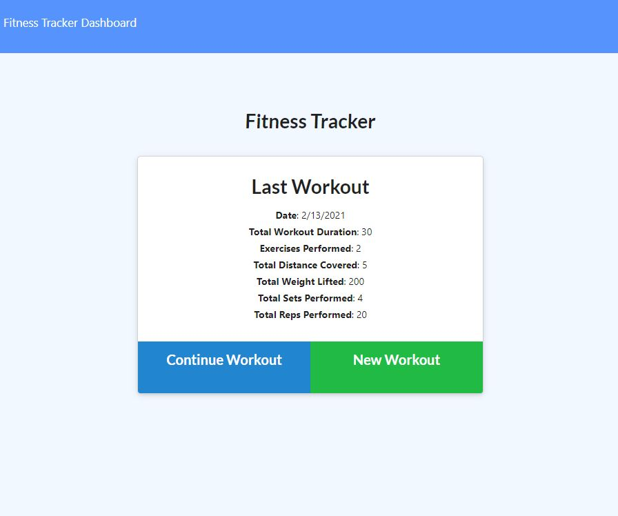
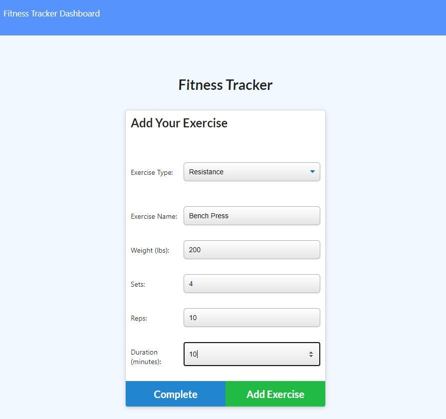
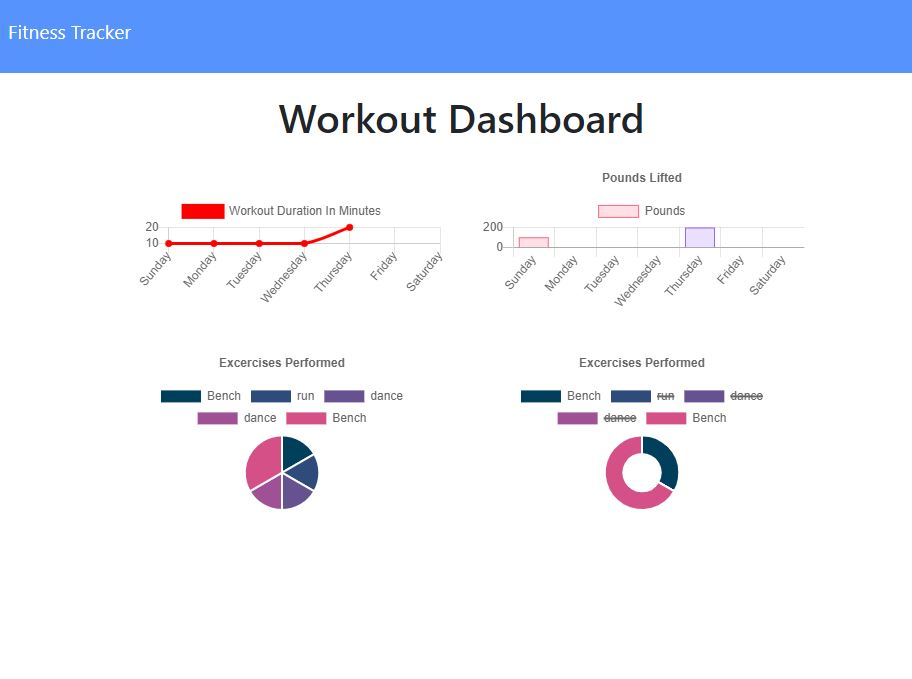

# Workout Tracker


## Table of Contents
* [Description](#description)
* [Links](#links)
* [User Story](#User_Story)
* [Acceptance Criteria](#Acceptance_Criteria)
* [Dependencies](#Dependencies)
* [Usage](#usage)
* [License](#license)

## Description
This application is a workout tracker for users to create and track their exercises. The front end code `Develop` folder was provided and I created the models, routes and server.js.

## Links
* Live Website: https://seattlesal-fitness-tracker.herokuapp.com/
* Github Link: https://github.com/SeattleSal/workout-tracker/

## User_Story
* As a user, I want to be able to view create and track daily workouts. I want to be able to log multiple exercises in a workout on a given day. I should also be able to track the name, type, weight, sets, reps, and duration of exercise. If the exercise is a cardio exercise, I should be able to track my distance traveled.

## Acceptance_Criteria
When the user loads the page, they should be given the option to create a new workout or continue with their last workout.

The user should be able to:

  * Add exercises to a previous workout plan.

  * Add new exercises to a new workout plan.

  * View the combined weight of multiple exercises on the `stats` page.

## Dependencies
The dependencies are:
* [express](http://expressjs.com/) for the web framework
* [mongoose](https://www.npmjs.com/package/mongoose) for the Object Modeling tool for use with MongoDB.
* [morgan](https://www.npmjs.com/package/morgan) for the middleware. 

There is a `package.json` included, the following commands should be run to install dependencies:

```bash
npm i
```

## Usage
Use the links above to use the application live. If you prefer to run the application from your computer, you can use the following command after installing the dependencies:

```bash
node server.js
```

The application displays a homepage with information about the last workout. The user can add exercises to the last workout or create a new workout. When the user creates a new workout they can choose to add Cardio (Name, Distance, Duration) or Resistance (Name, Weight, Sets, Reps, Duration) exercises. The user can also see statistics of their last 7 workouts in the dashboard.

See Screenshots:<br>
Home Page: <br>
<br>
Add Workout and Exercises: <br>
<br>
View Stats: <br>


## License

MIT License

Copyright (c) [2021] [Sally Perez]

Permission is hereby granted, free of charge, to any person obtaining a copy
of this software and associated documentation files (the "Software"), to deal
in the Software without restriction, including without limitation the rights
to use, copy, modify, merge, publish, distribute, sublicense, and/or sell
copies of the Software, and to permit persons to whom the Software is
furnished to do so, subject to the following conditions:

The above copyright notice and this permission notice shall be included in all
copies or substantial portions of the Software.

THE SOFTWARE IS PROVIDED "AS IS", WITHOUT WARRANTY OF ANY KIND, EXPRESS OR
IMPLIED, INCLUDING BUT NOT LIMITED TO THE WARRANTIES OF MERCHANTABILITY,
FITNESS FOR A PARTICULAR PURPOSE AND NONINFRINGEMENT. IN NO EVENT SHALL THE
AUTHORS OR COPYRIGHT HOLDERS BE LIABLE FOR ANY CLAIM, DAMAGES OR OTHER
LIABILITY, WHETHER IN AN ACTION OF CONTRACT, TORT OR OTHERWISE, ARISING FROM,
OUT OF OR IN CONNECTION WITH THE SOFTWARE OR THE USE OR OTHER DEALINGS IN THE
SOFTWARE.